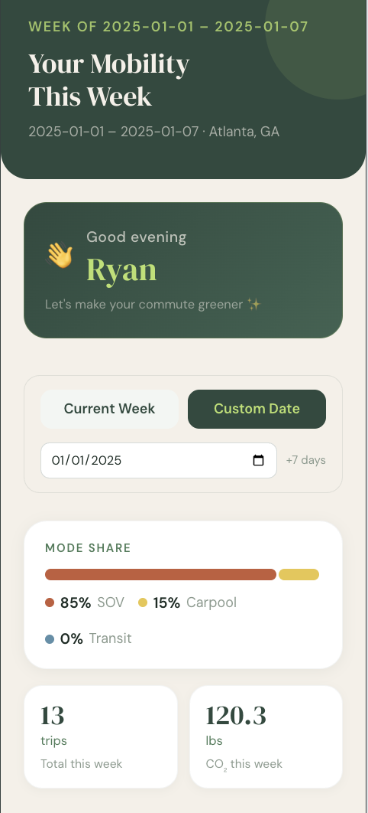
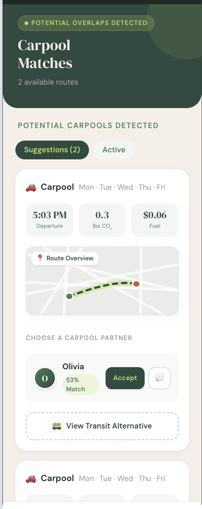
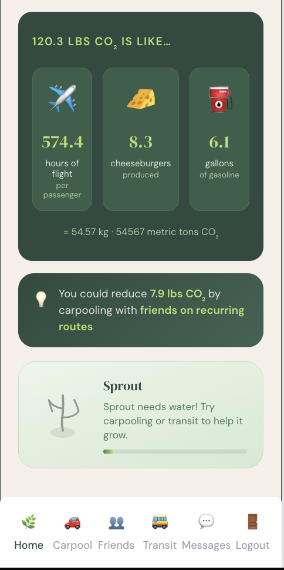
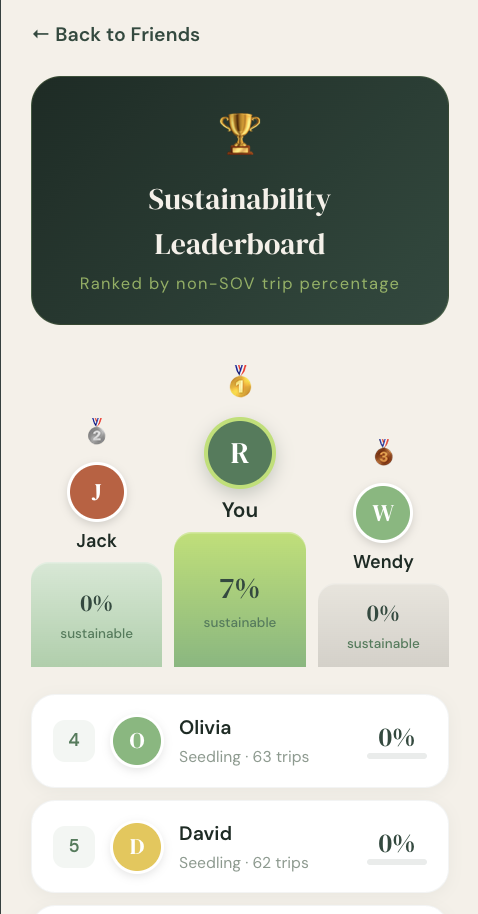

# deSOVer

**A community-driven eco-feedback platform for reducing single-occupancy vehicle (SOV) use.**

deSOVer passively detects recurring trips from location histories, identifies route overlaps within users' social networks, and surfaces personalized carpool and transit recommendations alongside eco-feedback. The system is designed for the Atlanta metro area and integrates real MARTA GTFS transit data.

Built for CS 8803: Computing for Sustainability — Georgia Institute of Technology, Spring 2026.

**Team:** Jacob Choe · Allanda Kriener · Christian Lee · Anubhav Mathur

---

## Live demo

| | URL |
|---|---|
| Frontend | https://desover-frontend.onrender.com |
| Backend API | https://desover-backend.onrender.com/docs |

> Both services are hosted on Render's free tier, which spins down after 15 minutes of inactivity. A cron job pings the API every 10 minutes to keep it warm — expect a brief cold-start delay if it's been idle.

---

## Screenshots

<table>
  <tr>
    <td align="center"><b>Eco Dashboard</b></td>
    <td align="center"><b>Carpool Matches</b></td>
    <td align="center"><b>CO₂ Feedback & Sprout</b></td>
    <td align="center"><b>Leaderboard</b></td>
  </tr>
  <tr>
    <td></td>
    <td></td>
    <td></td>
    <td></td>
  </tr>
</table>

---

## How it works

1. **Trip detection** — DBSCAN clustering (ε = 1 mi, min_samples = 2) identifies recurring origin-destination pairs from GPS traces.
2. **Carpool matching** — For each pair of friends with recurring trips, a four-scenario geometry scoring engine computes a compatibility score incorporating spatial proximity and schedule alignment.
3. **Transit suggestions** — A KD-tree over 8,981 MARTA stops finds walkable boarding points; GTFS schedules are filtered by day and departure window to surface viable bus/rail alternatives.
4. **Eco-feedback** — A weekly dashboard shows mode share, CO₂ emissions, and tangible equivalents (flight hours, cheeseburgers, gallons of gasoline), with a Sprout plant avatar that grows or wilts based on the user's weekly mode share.

---

## Repository structure

```
deSOVer/
├── backend/                  # FastAPI server
│   ├── main.py               # REST API (3 endpoints)
│   └── requirements.txt      # Backend Python dependencies
│
├── frontend/                 # React + Tailwind CSS app
│   ├── src/
│   │   ├── components/       # UI components (Dashboard, Carpool, Transit, Friends)
│   │   ├── hooks/            # Custom React hooks
│   │   └── constants/        # Shared constants
│   ├── package.json
│   └── vite.config.js
│
├── data/
│   ├── simulated/            # Synthetic trip data for 30 Atlanta-area users
│   │   ├── simulated.py      # Script to generate synthetic users/trips/friendships
│   │   ├── users.csv
│   │   ├── trips.csv
│   │   └── friendships.csv
│   └── google/               # Sample Google Timeline JSON exports
│
├── notebooks/
│   ├── CarpoolEngine.ipynb      # Carpool matching algorithm development & visualization
│   ├── TransitEngine_revised.ipynb  # MARTA GTFS transit engine development
│   ├── RecommendationEngine_Merged.ipynb      # Combined carpool and transit recommendation engines
│   └── upsert_supabase.ipynb        # Pipeline to load processed data into Supabase
│
├── screenshots/              # App screenshots used in this README
│
├── recurring_trips.py        # DBSCAN-based recurring trip detection
├── matching_trips.py         # Four-scenario carpool compatibility scoring
├── score_trips.py            # Scoring pipeline entry point
├── friendships.py            # Friendship graph parser
├── parse_gtimeline.py        # Parse Google timeline json files
└── requirements.txt          # Python dependencies for pipeline scripts and notebooks
```

---

## API endpoints

All endpoints return JSON. Interactive docs: `https://desover-backend.onrender.com/docs` (live) or `http://localhost:8000/docs` (local).

**Users**

| Method | Endpoint | Description |
|---|---|---|
| `POST` | `/users` | Create a user |
| `GET` | `/users/{user_id}` | Get user profile |

**Dashboard & recommendations**

| Method | Endpoint | Description |
|---|---|---|
| `GET` | `/users/{user_id}/weekly-summary` | Mode share breakdown, CO₂ emissions, and potential savings |
| `GET` | `/users/{user_id}/recommendations` | Carpool and transit suggestions grouped by friend and route |
| `PATCH` | `/recommendations/{rec_id}/status` | Accept or dismiss a recommendation |
| `GET` | `/users/{user_id}/sprout` | Eco-feedback plant score (0–100) and status message |

**Friends & leaderboard**

| Method | Endpoint | Description |
|---|---|---|
| `GET` | `/users/{user_id}/friends` | List friends |
| `POST` | `/users/{user_id}/friends` | Add a friend |
| `DELETE` | `/users/{user_id}/friends/{friend_id}` | Remove a friend |
| `GET` | `/users/{user_id}/non-friends` | List users not yet connected |
| `GET` | `/users/{user_id}/leaderboard` | Friends ranked by non-SOV trip percentage |

**Messaging**

| Method | Endpoint | Description |
|---|---|---|
| `GET` | `/users/{user_id}/inbox` | Get inbox (latest message per conversation) |
| `GET` | `/users/{user_id}/messages/{friend_id}` | Get full message thread with a friend |
| `POST` | `/users/{user_id}/messages` | Send a message |

---

## Local setup

### Prerequisites

- Python 3.11+
- Node.js 18+

### Backend (FastAPI)

From the repository root:

```bash
python -m venv venv
source venv/bin/activate       # Windows: venv\Scripts\activate
pip install -r requirements.txt
uvicorn backend.main:app --reload --port 8000
```

API available at `http://localhost:8000`.

### Frontend (React + Vite)

In a separate terminal:

```bash
cd frontend
npm install
npm run dev
```

Frontend available at `http://localhost:5173`.

> Start the backend before launching the frontend. Both connect to the shared Supabase instance by default — no local database setup required.

### Data pipeline (optional)

To regenerate synthetic data and reload the database:

```bash
python data/simulated/simulated.py   # regenerate CSVs
# then run notebooks/upsert_supabase.ipynb to push to Supabase
```

---

## Tech stack

| Layer | Technology |
|---|---|
| Frontend | React, Tailwind CSS, Vite, Axios |
| Backend | Python, FastAPI, psycopg2 |
| Database | PostgreSQL via Supabase (shared cloud instance) |
| Algorithms | scikit-learn (DBSCAN), Shapely, pyproj, scipy (KD-tree), geopy |
| Transit data | MARTA GTFS feed |
| Hosting | Render (frontend + backend) |

---

## Database schema

Five tables in Supabase: `users`, `friendships`, `trips`, `routines`, `recommendations`.

The `recommendations` table uses a `mode` field to distinguish carpool vs. transit suggestions, and a `details` JSONB column for scenario-specific data (geometry scores, route stops, etc.).

---

## Related SDGs

This project supports **SDG 11** (Sustainable Cities and Communities), **SDG 13** (Climate Action), and **SDG 3** (Good Health and Well-Being) by making shared mobility more socially accessible and environmentally legible.
